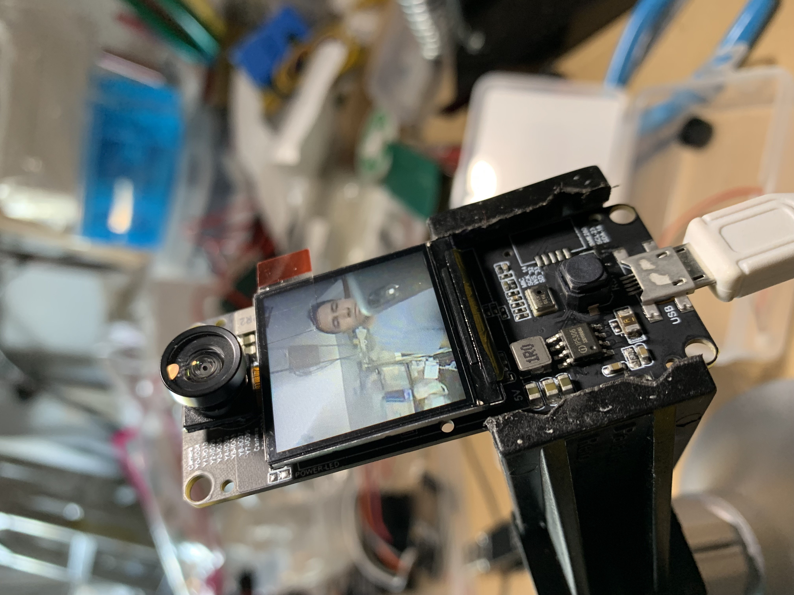

# Luz-Vision
## A world made with words for those visually impaired or blind. 

#### Artificial Intelligence (AI) in Assistive Technology.

#### Goal
The goal of this project is to see how technology can redefine the limitation or boundary of visually impaired or blind. It's a baby step to integrate AI into assistive technology. The ultimate goals is to make a small tiny device that can act as a virtual assistant using AI.

##### Option 1: Web RTC + AI ([DEMO](https://youtu.be/JLI_p2d0C-s))

[Watch the DEMO](https://youtu.be/JLI_p2d0C-s)

##### Option 2: Using hardware (Rasberry Pi + AI) ([DEMO](https://youtu.be/H8Pw1uwH2YU))

[Watch the DEMO](https://youtu.be/H8Pw1uwH2YU)

##### Option 3: (work in progress): Using embedded hardwares + AI

=============================================
##### Deploy (Using Docker Compose)
`cd docker`

`docker-compose up -d`

##### Deploy (Native)
`cd docker`

`pip install -r requirements.txt `

`cd ../scripts`

`python web-server.py`

Visit http://localhost:5002.

##### THIS IS WORK IN PROGRESS.

#### TO DO
- Integrate OCR to read text from camera. 
- More accuracte object level detection using custom training.
- .... huge list.

##### My other work related to AI [Content-AI](https://github.com/nycdidar/Content-AI)

> FULL CREDIT GOES TO EVERYONE INVOLVED IN ML/AI FIELD. WE WOULD BE IN STONE AGE WITHOUT THEIR DEDICATION AND HARD WORK.
